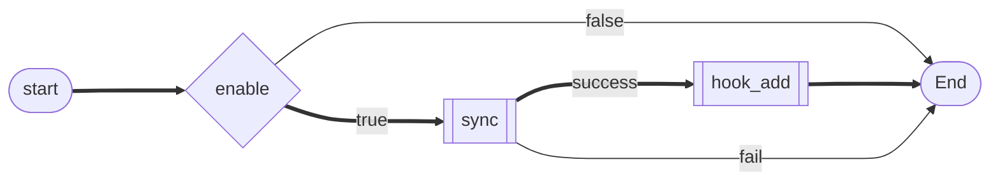

<div align='center'>

# Sinc

<samp>

**A cross-platform dotfiles manager**

</samp>

</div>

## WIP

This repository is still development. Use at your own lisk.

## Installation

```shell
$ cargo install sinc
```

## Getting started

### Config file

Sing looks for the config file in the following location:

- `$SINC_CONFIG_DIR/sinc/sinc.toml`
- `$XDG_CONFIG_HOME/sinc/sinc.toml`
- `$HOME/.config/sinc/sinc.toml`

### Minimal config

The following is the minimal config:

```toml
[default]
dir = "~/.dotfiles"
sync_type = "symlink"

[[dotfiles]]
path = "sinc"
target = "~/.config/sinc"
```

If you run the `sinc` command in this state, a symbolic link is created from `~/.dotfiles/sinc` to `~/.config/sinc`. \
In other words, the config files mentioned earlier have been moved to `~/.dotfiles/sinc` and a symbolic link has been created to the original location.

<div align='center'>

```haskell
(dir + path)         (sync_type)            (target)
 │                    │                    │
 V                    V                    V
~/.dotfiles/sinc  <<== symbolic link ==>>  ~/.config/sinc
```

</div>

Now, this config does not support applications that have different location for their config file depending on the OS.

To solve this, you can use [`sys(os)`](#configsys) instead of specifying the value directly.

```toml
[[dotfiles]]
path = "bat"
  [dotfiles.target."sys(os)"]
  default = "~/.config/bat"
  windows = "~/AppData/Roaming/bat"
```

## Configration value

### `Config`

| Key                         | Value type        |
| --------------------------- | ----------------- |
| [default](#configdefault)   | `Table`           |
| [dotfiles](#configdotfiles) | `Array of Tables` |

### `Config.default`

| Key       | Value type              |
| --------- | ----------------------- |
| dir       | `String`                |
| sync_type | [`SyncType`](#synctype) |

### `Config.dotfiles`

| Key       | Value type                  | Default value              |
| --------- | --------------------------- | -------------------------- |
| dir       | `String`                    | `Config.default.dir`       |
| sync_type | [`SyncType`](#synctype)     | `Config.default.sync_type` |
| target    | `String` or `Array<String>` |                            |
| path      | `String`                    |                            |
| enable    | `Boolean`                   | `true`                     |
| hook_add  | `String`                    | `""`                       |

The value set in `hook_*` will be executed as a command at the specified timing.



### `SyncType`

| Value        | Description                                             |
| ------------ | ------------------------------------------------------- |
| `"symlink"`  | If you are using Windows, you need administrator rights |
| `"junction"` | Windows only / used to link to folder                   |
| `"hardlink"` | Behave like the original file / used to link to file    |
| `"copy"`     | Just copy                                               |

### `Config.**.sys(...)`

| Name             | Key                                                                                                               | Key example  |
| ---------------- | ----------------------------------------------------------------------------------------------------------------- | ------------ |
| `sys(os)`        | <samp>[os_info::Type](https://github.com/stanislav-tkach/os_info#supported-operating-systems)</samp> (lower case) | `arch linux` |
| `sys(os_type)`   | <samp>[std::env::consts::OS](https://doc.rust-lang.org/std/env/consts/constant.OS.html)</samp>                    | `linux`      |
| `sys(os_family)` | <samp>[std::env::consts::FAMILY](https://doc.rust-lang.org/std/env/consts/constant.FAMILY.html)</samp>            | `unix`       |

<details>
<summary>example</summary>

```toml
[default]
dir = "~/.dotfiles"
sync_type."sys(os)" = { default = "symlink", windows = "junction" }

[[dotfiles]]
path = "bat"
  [dotfiles.target."sys(os)"]
  default = "~/.config/bat"
  windows = "~/AppData/Roaming/bat"

[[dotfiles]]
path = ".gitconfig"
target = "~/.gitconfig"
  [dotfiles.sync_type."sys(os)"]
  default = "symlink"
  windows = "hardlink"
```

</details>

### `Config.**.which(...)`

| Name             | Key                                                                  |
| ---------------- | -------------------------------------------------------------------- |
| `which(COMMAND)` | path to `COMMAND` or `""` to be selected if `COMMAND` does not exist |

<details>
<summary>example</summary>

```toml
[[dotfiles]]
path = "neofetch"
target = "~/.config/neofetch"
  [dotfiles.enable."which(neofetch)"]
  # Enabled if the "neofetch" executable exists somewhere in $PATH.
  default = true
  "" = false

[[dotfiles]]
path = "hyprland"
target = "~/.config/hypr"
  [dotfiles.enable."which(wrappedhl)"]
  # Enabled if the "wrappedhl" executable exists in "~/bin/wrappedhl" in $PATH.
  default = false
  "~/bin/wrappedhl" = true
```

</details>

## License

[MIT](./LICENSE)
